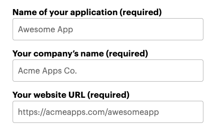
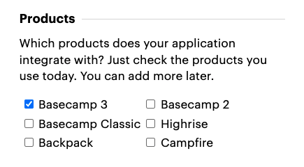
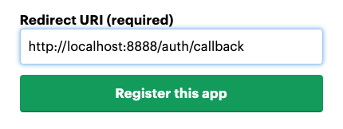

# Basecamp

A web app for visualizing and managing Basecamp projects and tasks.

Backend built with:

- [Basecamp 3 API](https://github.com/basecamp/bc3-api)
- [Express](https://expressjs.com/)

Frontend built with:
- [Vite](https://vitejs.dev/guide/)

## Auth Demo

The Auth flow uses the local `/auth` route to send a new authorization request to Basecamp.
Once authorized, the callback receives a time-sensitive code, which is then traded for an access token and refresh token.

This is a quick demo of how the auth flow works:


## Project Setup

1. [Create a free Basecamp account](https://3.basecamp.com/signup/account/new?plan=free_v2).
2. [Register a Basecamp 3 app](https://launchpad.37signals.com/integrations/new) using your free Basecamp account.
    - Name your app, give it a name, and add your website.
    - 
    - Select **Basecamp 3** in the *Products* section.
    - 
    - Add `http://localhost:8888/auth/callback` as a Redirect URI in the app  settings.
    - 
3. Run this to install packages and create `.env` file
  >   ```bash
  >    npm install
  >    touch .env
  >   ```
4. Update `.env` file with the `Client ID` & `Client Secret` you receive from Basecamp.
>   ```shell
>   CLIENT_ID = ***client_id_here***
>   CLIENT_SECRET = ***client_secret_here***
>   REDIRECT_URI = http://localhost:8888/auth/callback
>   PORT = 8888
>   ```

5. Run this to start the dev server:
  >   ```bash
  >    npm run dev
  >   ```